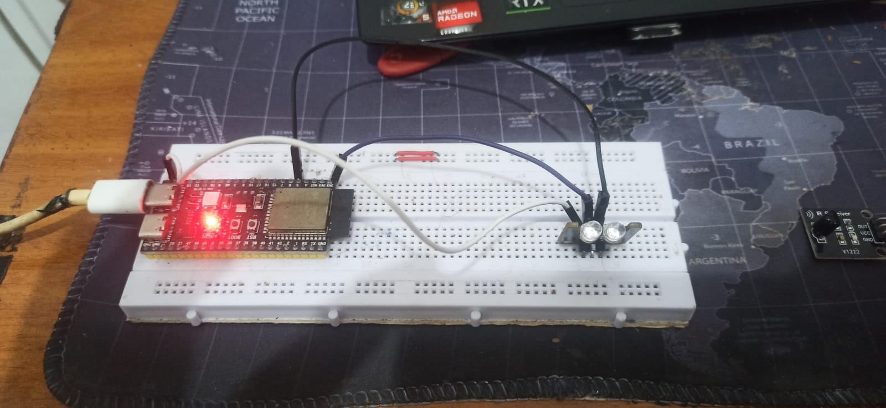
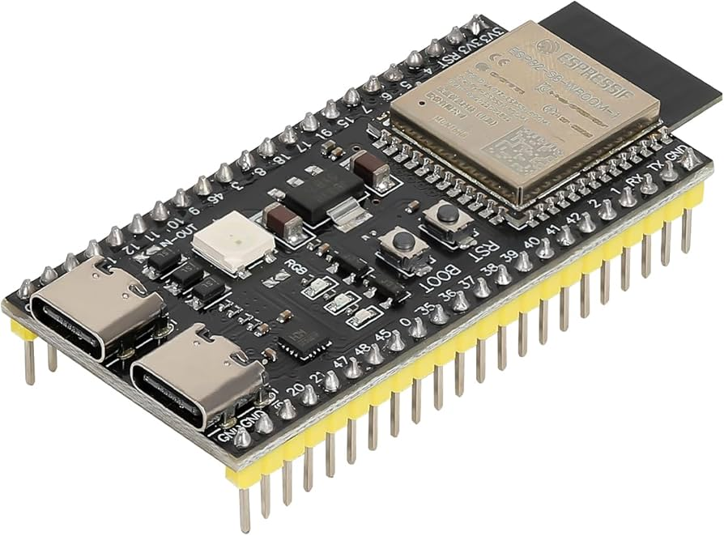

# Universal AC Smart Remote (Blynk IoT)

---

## Latar Belakang & Motivasi
Proyek *Independent/Personal* ini murni didasari oleh keresahan pribadi saya sebagai mahasiswa di Surabaya. Cuaca Surabaya yang sangat panas membuat kondisi kamar kos terasa seperti oven saat baru pulang bepergian atau pulang kuliah. 

Kondisi tersebut memotivasi saya untuk mendesain dan merancang alat pintar berbasis IoT yang memungkinkan saya untuk **menyalakan dan mengontrol AC di kamar kos dari mana saja** sebelum saya tiba. Dengan begitu, kamar sudah berada dalam kondisi sejuk tepat ketika saya membuka pintu.

## Fitur Utama
- **Kontrol Jarak Jauh (Anywhere Access):** Terintegrasi penuh dengan platform **Blynk IoT** untuk kontrol melalui aplikasi *mobile* dari jaringan mana pun.
- **Multibrand Support:** Menggunakan pustaka (library) sakti `IRremoteESP8266`, sistem ini secara dinamis bisa mengganti jenis sinyal protokol AC untuk berbagai merek populer di Indonesia, antara lain:
  - Midea (Coolix)
  - LG
  - Sharp
  - Daikin
  - Panasonic
  - Aqua (Haier / Sanyo)
- **Auto-Provisioning WiFi:** Menggunakan `WiFiManager`, alat tidak memerlukan *hardcode* kata sandi WiFi, sehingga sangat *plug-and-play* jika dibawa pindah ke jaringan baru.
- **Visualisasi Real-time:** Menampilkan Mode (Cool/Auto), Suhu, dan Merek AC langsung di panel LCD virtual aplikasi Blynk.

---

## Spesifikasi Perangkat Keras & Rangkaian
Berikut adalah perangkat keras yang menyusun sistem ini beserta skema pemasangannya:
1. **Microcontroller:** ESP32-S3 (Sangat kompatibel dengan varian murah dan kecil seperti ESP32-C3 Supermini).
2. **IR Transmitter Dual Channel:** Bertugas memancarkan kode infra-merah ke arah AC.
3. **IR Receiver:** Digunakan untuk *reverse-engineering* atau *sniffing* terhadap kode remote AC bawaan jika merek belum didukung.

  

### Konfigurasi Pin (Wiring)
Pemasangan modul *Transmitter* maupun *Receiver* memiliki alur skematik yang sama persis:
- **GND** dihubungkan ke **GND** ESP32
- **VCC** dihubungkan ke **VCC / 3.3V** ESP32
- **Data (Signal)** dihubungkan ke **Pin 16** ESP32

   
   
  

---

## Alur Pengerjaan & Cara Penggunaan
1. **Perakitan:** Hubungkan komponen sesuai dengan *Konfigurasi Pin* di atas. Pastikan IR Transmitter diarahkan ke penerima sinyal pada mesin AC.
2. **Persiapan Sistem:** Unggah program (`.ino`) ke ESP32. Setelah menyala, alat akan memancarkan *WiFi Access Point* melalui fitur *WiFiManager*. Hubungkan ponsel Anda ke jaringan tersebut untuk melakukan penyetelan kata sandi WiFi kosan secara dinamis.
3. **Penggunaan Blynk:** Buka aplikasi Blynk di ponsel Anda. Alat sudah online dan Anda dapat langsung mengontrol Suhu, Mode, serta memilih Merk AC.
4. **Menambahkan Merk AC Baru (Sniffing):** 
   Apabila AC yang digunakan belum ada di dalam daftar program, Anda dapat melakukan konfigurasi mandiri menggunakan modul **IR Receiver**: 
   - Unggah program khusus pembaca sinyal bawaan dari *library* `IRremoteESP8266` (seperti contoh kode `IRrecvDumpV2` atau `IRrecvDumpV3`).
   - Arahkan *remote* AC asli Anda ke IR Receiver dan tekan tombol daya/suhu.
   - Baca dan cermati *output* di *Serial Monitor* untuk mengetahui jenis *protocol/decode type* apa yang digunakan AC tersebut.
   - Masukkan protokol baru tersebut ke dalam `decode_type_t VENDORS[]` pada kode `Remote_AC_multi_brand.ino` agar aplikasi dapat mengontrol merek tersebut.

---

## Dependensi & Perangkat Lunak
Pastikan pustaka berikut terinstal di dalam Arduino IDE Anda sebelum melakukan kompilasi (*compile*):
- `BlynkSimpleEsp32.h` (Komunikasi IoT Blynk)
- `IRremoteESP8266.h` & `IRac.h` (Protokol dan konstruksi sinyal IR AC)
- `WiFiManager.h` (Portal penangkap koneksi WiFi)

---

## Kontributor & Pengembangan
**Ali Akbar Alhabsyi (ali1140)**  
Proyek ini membuktikan kemampuan saya dalam memecahkan masalah (*problem solving*) dunia nyata menggunakan pendekatan teknik tertanam (*Embedded Engineering*). Kompleksitas utama dalam proyek ini terletak pada pemahaman lapisan protokol inframerah (*Infrared Protocol Layer*) yang rumit untuk setiap merek AC yang berbeda, yang kemudian berhasil diabstraksikan menjadi antarmuka UI aplikasi seluler yang sangat intuitif.
